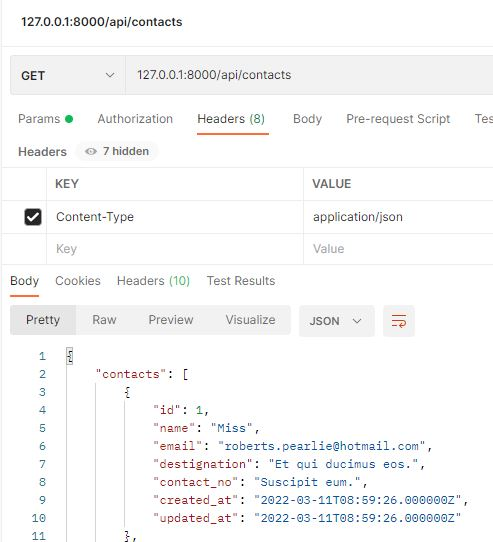

## Main stages of development

#### 1. Installation Project Template. Create Database

`composer create-project --prefer-dist  laravel/laravel .`   
`npm install`  
`npm run dev`  

`git init`  
`git add .`  
`git commit –m "Comment"`  
**`git remote add origin https://github.com/SergeyHub/laravel_crud_api_vue_back.git`**  
`git push -u origin master`  

##### 1.1 Postgersql
```
Let's start SQL Shell (psql). The program will prompt you to enter the name    
of the server, database, port and user. You can click/skip these items as they  
will use the default values   
(for server - localhost, for database - postgres, for port - 5432,  
as user - postres superuser). 
Next, you will need to enter a password for the user   
(by default, the postgres user): 123456 (in my case)  
```

   

`postgres=# create database db_name;`  
  **database list**  
`select datname from pg_database;`   
pg_dump dbname > outfile 

**`Edit  env. file`**    
```
DB_CONNECTION=pgsql
DB_HOST=localhost
DB_PORT=5432
DB_DATABASE=cargo
DB_USERNAME=postgres
DB_PASSWORD=123456
```
##### 1.2 MySQL

`mysql -u root -p`  
`create database crud_api; db_name;`  
`drop database db_name;`   
`show databases;`  
`use db_name;`  
`show tables;`   
`drop table table_name;`  
`exit`  

**`Edit  env. file`**   
```
DB_CONNECTION=mysql
DB_HOST=127.0.0.1
DB_PORT=3306
DB_DATABASE=crud_api
DB_USERNAME=root
DB_PASSWORD=123456
```
##### 1.3 Migration

`php artisan migrate`  

##### 1.4 Version
`npm -v`  
`php -v`

#### 2. ContactController Contact Model Table & api route
`php artisan make:controller ContactController`    
`php artisan make:model Contact -m`    
`php artisan migrate`  

#### 3. Table Contact : Seeding
`php artisan make:factory ContactFactory`  
```
return [
    'name' => $this->faker->title(15),
    'email' => $this->faker->email,
    'destignation' => $this->faker->text(25),
    'contact_no' => $this->faker->text(15),
];
```
`php artisan make:seeder ContactSeeder`  
```
Contact::factory()->count(25)->create();
```
`php artisan db:seed --class=ContactSeeder`  

 

#### ContactController saveContact Method  
Create the POST API to insert data in database.   
Test  POST API with postman  

```
        $contact = new Contact();
        $contact->name = $request->name;
        $contact->email = $request->email;
        $contact->destignation = $request->destignation;
        $contact->contact_no = $request->contact_no;

        $contact->save();
        return response()->json([
            'message' => 'Contact Created Successfully',
            'code' => 200

        ]);
```
```
Route::get('contacts', [ContactController::class, 'contacts']);
Route::post('save_contact', [ContactController::class, 'saveContact']);
```
 

